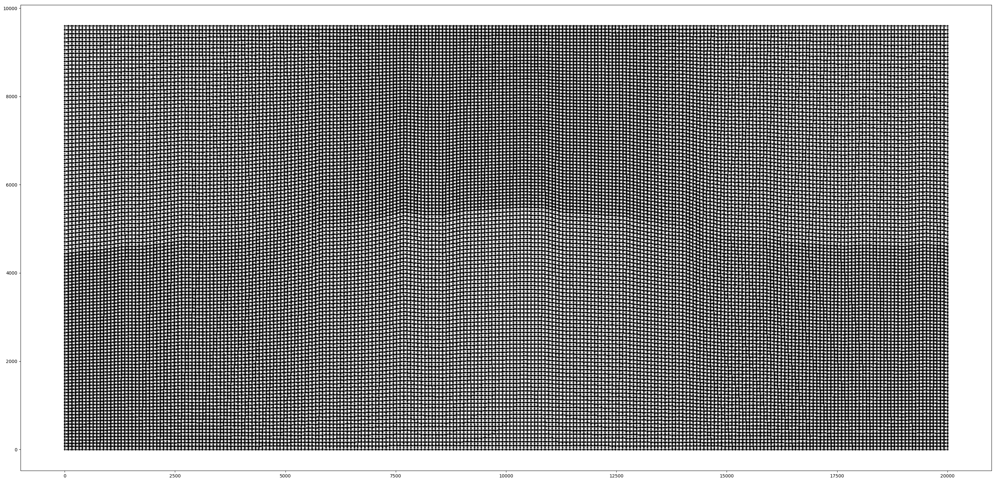
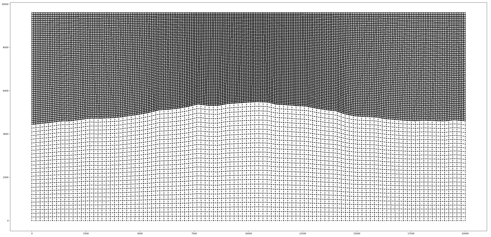
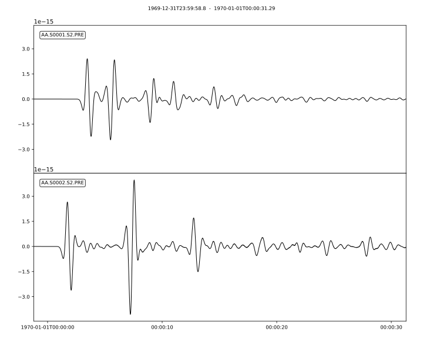
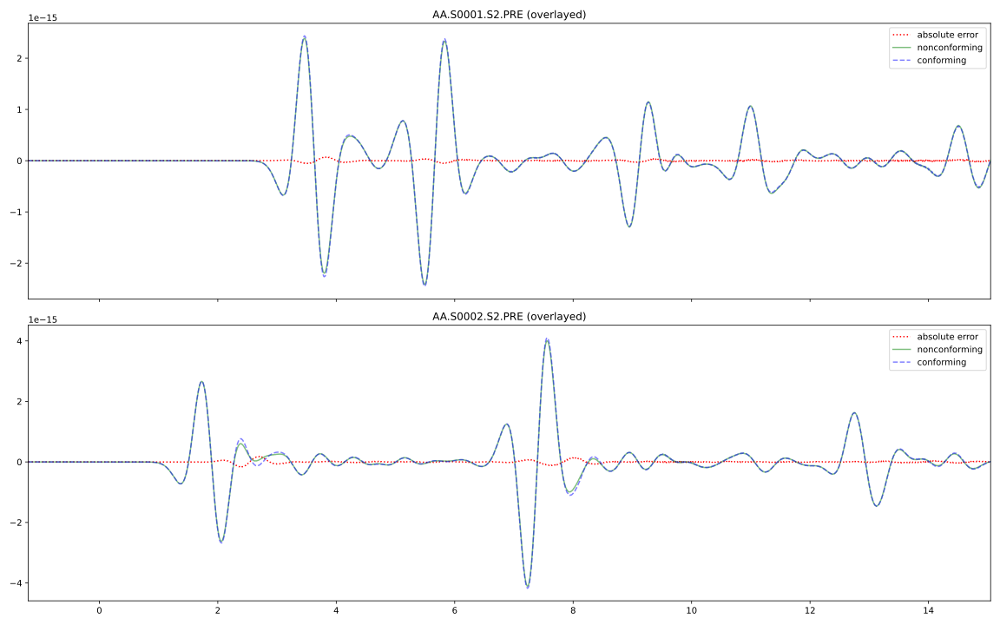
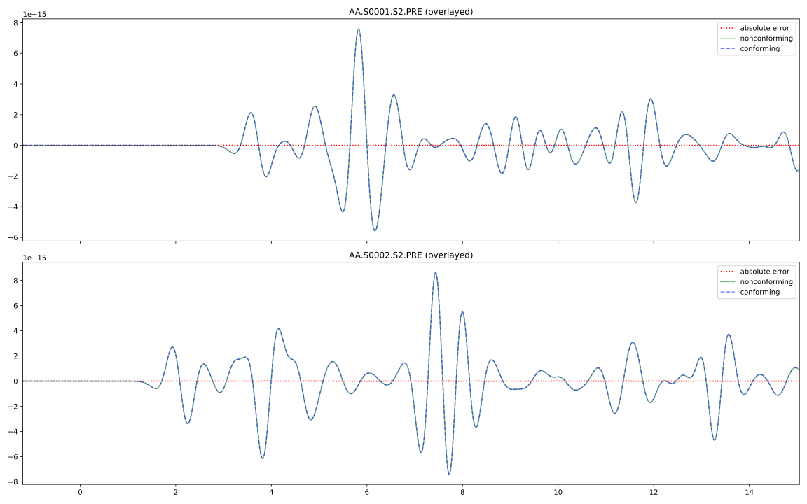

################################################################
 Wave propagation through a nonconforming fluid-solid interface
################################################################

This example extends the :doc:`fluid-solid-bathymetry
</sections/cookbooks/dim2/fluid-solid-bathymetry/index>` example,
however this cookbook does not expect that you have done it.

By using a nonconforming mesh to model a fluid-solid interface, we can
rather inexpensively simulate wave propagation between these two media,
despite their vastly different parameters.

Since ``xmeshfem2D``'s internal mesher does not generate nonconforming
meshes, we have provided a ``gmshlayerbuilder`` script to take a
topography file (normally read in by ``Par_file``) and generate a mesh
for ``xmeshfem2D`` to generate a database for.

**************************
 Setting up the workspace
**************************

Let's start by creating a workspace from where we can run this example.

.. code:: bash

   mkdir -p ~/specfempp-examples/fluid-solid-nonconforming
   cd ~/specfempp-examples/fluid-solid-nonconforming

We also need to check that the SPECFEM++ executable directory is added
to the ``PATH``.

.. code:: bash

   which specfem2d

If the above command returns a path to the ``specfem2d`` executable,
then the executable directory is added to the ``PATH``. If not, you need
to add the executable directory to the ``PATH`` using the following
command.

.. code:: bash

   export PATH=$PATH:<PATH TO SPECFEM++ DIRECTORY/bin>

.. note::

   Make sure to replace ``<PATH TO SPECFEM++ DIRECTORY/bin>`` with the
   actual path to the SPECFEM++ directory on your system.

Now let's create the necessary directories to store the input files and
output artifacts.

.. code:: bash

   mkdir -p OUTPUT_FILES
   mkdir -p OUTPUT_FILES/seismograms
   mkdir -p OUTPUT_FILES/results
   mkdir -p OUTPUT_FILES/display

   touch specfem_config.yaml
   touch line_source.yaml
   touch topography_file.dat
   touch Par_file

********************
 Meshing the domain
********************

We first start by generating an external mesh from our topography file.
This is the same as the ``fluid-solid-bathymetry`` example.

.. literalinclude:: ../fluid-solid-bathymetry/topography_file.dat
   :caption: old topography_file.dat
   :language: bash

The ``gmshlayerbuilder`` script is in ``<SPECFEM++ DIRECTORY>/scripts``.
You will need to either replace ``-m gmshlayerbuilder`` below with the
path to ``gmshlayerbuilder``, or add ``scripts`` to your ``PYTHONPATH``:

.. code:: bash

   export PYTHONPATH="${PYTHONPATH}:<PATH TO SPECFEM++ DIRECTORY/scripts>"

.. note::

   Make sure to replace ``<PATH TO SPECFEM++ DIRECTORY/scripts>`` with
   the actual path to the SPECFEM++ directory on your system.

If you've updated ``PYTHONPATH``, ``python`` can run
``gmshlayerbuilder`` as a module:

.. code:: bash

   python -m gmshlayerbuilder --top acoustic_free_surface --bottom absorbing --left absorbing --right absorbing topography_file.dat OUTPUT_FILES/MESH

Otherwise, you can drop the ``-m`` flag and reference the script
exactly:

.. code:: bash

   python <SPECFEM++ DIRECTORY>/scripts/gmshlayerbuilder ...

.. note::

   Make sure that you are using the ``scripts`` dependency group. When
   installing with ``pip``, ``uv``, or some other tool, add ``--group
   scripts`` or use all dependency groups with ``--all-groups``.

You can see the generated mesh with ``matplotlib`` by passing in the
``--plot`` flag (you may need to install an interactive backend, like
``pyqt6``), but at the default resolution, it will be slow.

   Mesh of the unmodified topography file.

``gmshlayerbuilder`` takes the ``nz`` parameters of each layer and
chooses the horizontal resolution ``nx`` that keeps the aspect ratio of
each element near one. For a more sensible mesh, we can choose ``nz`` in
the crust to be a lower number (say 25, which is approximately
:math:`{c_\text{water}}/{(c_\text{p})_\text{crust}}` times the original
resolution).

.. literalinclude:: topography_file.dat
   :language: bash
   :emphasize-lines: 533
   :caption: modified topography_file.dat

   Mesh of the modified topography file.

Parameter file
==============

We told ``gmshlayerbuilder`` to save the external mesh files into
``OUTPUT_FILES/MESH``. We now read those files into ``xmeshfem2D``
through the parameter file, with the ``read_external_mesh`` flag set to
true. We're also setting the second receiver a little higher to ensure
that it is inside the acoustic regime, no matter how we discretized the
topography.

.. literalinclude:: Par_file
   :language: bash
   :emphasize-lines: 59,61,88,98-107
   :caption: Par_file

Running ``xmeshfem2D``
======================

To execute the mesher run

.. code:: bash

   xmeshfem2D -p Par_file

Note the path of the database file and a stations file generated after
successfully running the mesher.

Defining the source
===================

The sources are set as in the :doc:`fluid-solid-bathymetry
</sections/cookbooks/dim2/fluid-solid-bathymetry/index>` example.

.. literalinclude:: ../fluid-solid-bathymetry/line_source.yaml
   :caption: line_source.yaml
   :language: yaml

************************
 Running the simulation
************************

To run the solver, we need a configuration file. We use a
``specfem_config.yaml`` file similar to the ``fluid-solid-bathymetry``
example.

.. literalinclude:: specfem_config.yaml
   :language: yaml
   :caption: specfem_config.yaml

With the configuration file in place, we can run the solver using the
following command:

.. code:: bash

   specfem2d -p specfem_config.yaml

*************************
 Visualizing the results
*************************

The simulation generates seismograms at the stations defined in the
``specfem_config.yaml`` file and wavefield snapshots for visualization.
You can visualize the seismograms using the following python script.

.. literalinclude:: ../fluid-solid-bathymetry/plot.py
   :language: python
   :caption: plot.py

The output image should look like this:

********************************************
 [Optional] Creating animated visualization
********************************************

To create an animated gif of the wavefield evolution, you can use
ImageMagick (if available):

.. code:: bash

   magick OUTPUT_FILES/display/wavefield*.png -trim +repage -delay 10 -loop 0 fluid-solid-bathymetry.gif

The output animated gif will show the wavefield evolution over time,
illustrating the interaction of seismic waves with the complex
bathymetry and fluid-solid interfaces. The animation captures how the
waves propagate through the acoustic and elastic domains, reflecting and
refracting at the seafloor interface.

.. image:: fluid-solid-nonconforming.gif
   :width: 100%
   :alt: Animated wavefield evolution

***********************************************
 Appendix: Comparison to conforming simulation
***********************************************

We can return to a conforming scheme by disabling the external mesher

.. code:: fortran

   read_external_mesh              = .false.

and setting the topography file to the original.

.. code:: bash

   ...
   # layer number 1 (bottom layer)
   #
   ## The original 2000 Geophysics paper used nz = 90 but NGLLZ = 6
   ## here I rescale it to nz = 108 and NGLLZ = 5 because nowadays we almost always use NGLLZ = 5
   26
   #
   # layer number 2 (top layer)
   #
   58

We can run this simulation and plot it against the nonconforming run.

We can notice a relative error reaching up to 3% in the ``S0001`` trace
and 4% in the ``S0002`` trace. Since the elastic side is at a much lower
resolution, errors due to bathymetric resolution are expected (note that
due to ``ngnod==9``, the exponent on grid size for numerical truncation
error is lower than the solver). So, be sure to continue respecting
domain geometry when choosing mesh sizes.

A smoother bathymetry will provide simulations that agree closer:

.. image:: fluid-solid-nonconforming-different-bathy.gif
   :width: 100%
   :alt: Animated wavefield evolution of a different bathymetric profile

