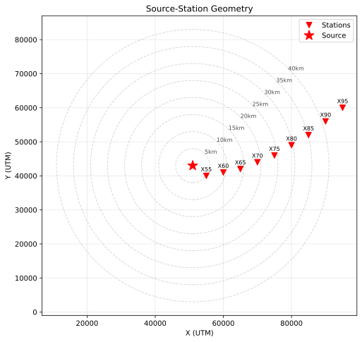
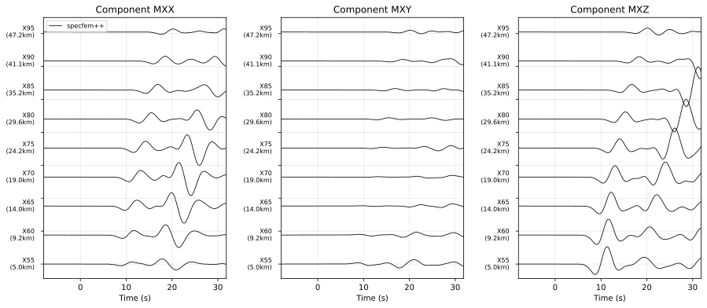
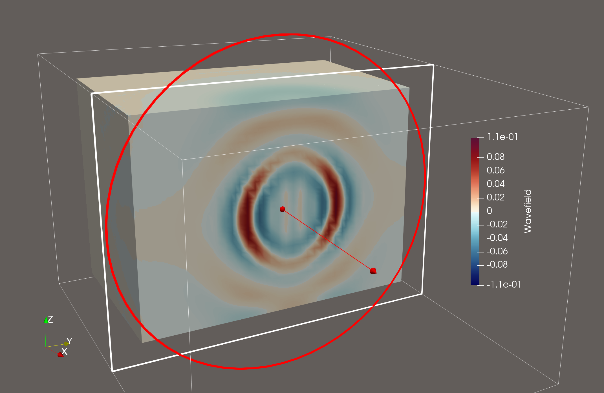

.. _homogeneous_halfspace_3d_example:

Wave propagation through 3D homogeneous media
==============================================

In this example we simulate wave propagation through a 3-dimensional homogeneous halfspace using a force source.

Setting up your workspace
--------------------------

Let's start by creating a workspace from where we can run this example.

.. code-block:: bash

    mkdir -p ~/specfempp-examples/homogeneous-halfspace-single-force
    cd ~/specfempp-examples/homogeneous-halfspace-single-force

We also need to check that the SPECFEM++ executable directory is added to the
``PATH``.

.. code:: bash

    which specfem3d

If the above command returns a path to the ``specfem3d`` executable, then the
executable directory is added to the ``PATH``. If not, you need to add the executable
directory to the ``PATH`` using the following command.

.. code:: bash

    export PATH=$PATH:<PATH TO SPECFEM++ DIRECTORY/bin>

.. note::

    Make sure to replace ``<PATH TO SPECFEM++ DIRECTORY/bin>`` with the
    actual path to the SPECFEM++ directory on your system.

Now let's create the necessary directories to store the input files and output
artifacts.

.. code:: bash

    mkdir -p OUTPUT_FILES
    mkdir -p OUTPUT_FILES/results
    mkdir -p OUTPUT_FILES/DATABASES
    mkdir -p DATA
    mkdir -p DATA/meshfem3D_files

    touch specfem_config.yaml
    touch force.yaml

Generating a mesh
-----------------

To generate the mesh for the homogeneous halfspace we need a mesh parameter file,
``Mesh_Par_file``, interface files (``interfaces.txt`` and ``interface1.txt``),
and the mesher executable, ``xmeshfem3D``, which should have been compiled during
the installation process.

.. note::
  The 3D mesher is based on the mesher developed for `SPECFEM3D Cartesian <https://specfem3d.readthedocs.io/>`_.
  More details on the meshing process can be found in the SPECFEM3D Cartesian documentation.

We first define the meshing parameters in a Mesh Parameter file.

Mesh Parameter File
~~~~~~~~~~~~~~~~~~~~

.. literalinclude:: DATA/meshfem3D_files/Mesh_Par_file
    :caption: Mesh_Par_file
    :language: bash
    :emphasize-lines: 10-14,20,33-34,70,90,97,106,109

At this point, it is worthwhile to note a few key parameters within the
``Mesh_Par_file`` as it pertains to SPECFEM++.

- This version of SPECFEM++ does not support simulations running across multiple
  cores/nodes, i.e., we have not enabled MPI. Relevant parameter values:

  .. literalinclude:: DATA/meshfem3D_files/Mesh_Par_file
      :language: bash
      :linenos:
      :start-at: NPROC_XI
      :end-at: NPROC_ETA
      :lineno-match:

- The mesh domain is defined by the coordinates and depth. In this case we define
  a domain that is 100km x 80km x 60km. Relevant parameter values:

  .. literalinclude:: DATA/meshfem3D_files/Mesh_Par_file
      :language: bash
      :linenos:
      :start-at: LATITUDE_MIN
      :end-at: SUPPRESS_UTM_PROJECTION
      :lineno-match:

- The number of elements along the XI and ETA directions define the horizontal
  resolution of the mesh:

  .. literalinclude:: DATA/meshfem3D_files/Mesh_Par_file
      :language: bash
      :linenos:
      :start-at: NEX_XI
      :end-at: NEX_ETA
      :lineno-match:

- The path to the interfaces file is provided using the ``INTERFACES_FILE``
  parameter:

  .. literalinclude:: DATA/meshfem3D_files/Mesh_Par_file
      :language: bash
      :linenos:
      :start-at: INTERFACES_FILE
      :end-at: INTERFACES_FILE
      :lineno-match:

- We define a single homogeneous material with density 2300 kg/m³, Vp = 2800 m/s,
  and Vs = 1500 m/s. The domain type is set to 2 (elastic):

  .. literalinclude:: DATA/meshfem3D_files/Mesh_Par_file
      :language: bash
      :linenos:
      :start-at: NMATERIALS
      :end-at: 1   2300.0   2800.0   1500.0  0 0 0 2
      :lineno-match:

- We define a single region that spans the entire mesh and assigns material 1 to it:

  .. literalinclude:: DATA/meshfem3D_files/Mesh_Par_file
      :language: bash
      :linenos:
      :start-at: NREGIONS
      :end-at: 1              15           1               12            1         9        1
      :lineno-match:

Interfaces file
~~~~~~~~~~~~~~~~

The interfaces file defines the topography and layer structure of the mesh.

.. literalinclude:: DATA/meshfem3D_files/interfaces.txt
    :caption: interfaces.txt
    :language: bash
    :emphasize-lines: 10-11,16

The interfaces file describes:

- The number of interfaces (in this case, 1 - the top surface)
- For each interface: whether it's defined by a file (`.true.`), the number of
  points along XI and ETA directions, the starting coordinates (0.0, 0.0),
  and spacing (1000.0, 1000.0)
- The path to the interface data file
- The number of spectral elements in the vertical direction for each layer (9 elements)

Interface data file
~~~~~~~~~~~~~~~~~~~

The interface data file contains the elevation values at the grid points:

.. literalinclude:: DATA/meshfem3D_files/interface1.txt
    :caption: interface1.txt
    :language: bash

In this case, all elevation values are 0, meaning we have a flat top surface.

Running ``xmeshfem3D``
~~~~~~~~~~~~~~~~~~~~~~

To execute the mesher run:

.. code:: bash

    xmeshfem3D -p DATA/meshfem3D_files/Mesh_Par_file

Check the mesher generated files in the ``OUTPUT_FILES/DATABASES`` directory:

.. code:: bash

    ls -ltr OUTPUT_FILES/DATABASES

You should see files including:

- ``proc000000_Database.bin`` - the mesh database
- ``proc000000_mesh.vtk`` - mesh visualization file
- ``proc000000_skewness.vtk`` - mesh quality visualization file

Defining receivers (stations)
------------------------------

In 3D simulations, we need to explicitly define the receiver locations using a
STATIONS file.

.. literalinclude:: DATA/STATIONS
    :caption: STATIONS
    :language: bash

Each line defines a station with the format:

``STATION_NAME NETWORK_CODE X Y ELEVATION BURIAL``

where:

- X, Y are the horizontal coordinates in the mesh coordinate system
- ELEVATION is the height above the surface (typically 0.0)
- BURIAL is the depth below the surface (typically 0.0)

In this example, we have 9 stations distributed across the domain.

Defining sources
----------------

Next we define the sources using a YAML file. For a full description of parameters
used to define sources refer to :ref:`source_description`.

.. literalinclude:: force.yaml
    :caption: force.yaml
    :language: yaml
    :emphasize-lines: 3-10,11-14

In this file, we define a single force source with:

- Position: x=51000m, y=43000m, z=-31000m (note: negative z is depth)
- Force components: fx=0, fy=0, fz=1e14 (vertical force)
- Source time function: Ricker wavelet with center frequency 0.15 Hz

Configuring the solver
----------------------

Now that we have generated a mesh and defined the sources and receivers, we need to
set up the solver. We define the configuration in a YAML file ``specfem_config.yaml``.
For a full description of parameters refer to :ref:`parameter_documentation`.

.. literalinclude:: specfem_config.yaml
    :caption: specfem_config.yaml
    :language: yaml
    :emphasize-lines: 3-12,14-31,40-45,53-57

At this point let's focus on a few sections in this file:

- Configure the solver using the ``simulation-setup`` section:

  .. literalinclude:: specfem_config.yaml
      :caption: specfem_config.yaml
      :language: yaml
      :linenos:
      :start-at: simulation-setup
      :end-at: directory: "OUTPUT_FILES/results"
      :lineno-match:

  * We define the integration quadrature to be used in the simulation (``GLL4``)
  * Define the time-stepping scheme (Newmark), time step (0.16s), and number of steps (250)
  * Set the output format for seismograms to ASCII

- Define receiver (station) configuration:

  .. literalinclude:: specfem_config.yaml
      :caption: specfem_config.yaml
      :language: yaml
      :linenos:
      :start-at: receivers:
      :end-at: nstep_between_samples
      :lineno-match:

  * Specify the path to the STATIONS file
  * Set the seismogram type to displacement
  * Set the sampling rate (nstep_between_samples=1 means sample every time step)

- Define the path to the mesh database and source description file:

  .. literalinclude:: specfem_config.yaml
      :caption: specfem_config.yaml
      :language: yaml
      :linenos:
      :start-at: databases:
      :end-at: sources: "force.yaml"
      :lineno-match:

Running the solver
------------------

Finally, to run the SPECFEM++ solver:

.. code:: bash

    specfem3d -p specfem_config.yaml

.. note::

    Make sure either you are in the executable directory of SPECFEM++ or the
    executable directory is added to your ``PATH``.

The solver will output progress information to the terminal and write seismograms
to the ``OUTPUT_FILES/results`` directory.

Visualizing seismograms
-----------------------

Let us now plot the source-station geometry and the traces generated by the solver.
The following Python script reads the ASCII seismogram files and creates two separate
plots:

1. Source-station geometry with distance circles
2. Seismograms for each component (MXX, MXY, MXZ) sorted by epicentral distance

.. literalinclude:: plot_seismograms.py
    :language: python
    :linenos:

To run the plotting script:

.. code:: bash

    python plot_seismograms.py

This will create two plots in the ``OUTPUT_FILES`` directory:

- ``geometry.png`` - showing the source-station geometry
- ``seismograms.png`` - showing the recorded seismograms for all three displacement components

   Source-station geometry. The source is marked by a red star and stations by red
   triangles. Concentric circles indicate epicentral distances in kilometers.

   Seismograms recorded at stations distributed across the homogeneous halfspace.
   The three panels show displacement components (MXX, MXY, MXZ), with traces
   sorted by epicentral distance from top to bottom.

[Optional] Visualizing the wavefield
------------------------------------

To visualize the wavefield propagation through the homogeneous halfspace, we
have a couple of prerequisites. First, SPECFEM++ must be built with VTK *and*
HDF5 support. Second, Paraview (https://www.paraview.org/) needs to be installed
on your system to visualize the output files. Once these prerequisites are met,
we can uncomment ``display`` section in the ``specfem_config.yaml`` file to
include the following configuration:

.. code:: yaml

    display:
      format: VTKHDF
      directory: OUTPUT_FILES/
      field: displacement
      component: z
      simulation-field: forward
      time-interval: 5

Rerun the solver with the updated configuration. Then open Paraview and load the
generated VTK files from the ``OUTPUT_FILES`` directory to visualize the wavefield
propagation.

   Snapshot of the vertical displacement wavefield propagating through the
   homogeneous halfspace at a given time step. We sliced the cube halfway along
   the X-axis to visualize the wavefield inside the volume.
